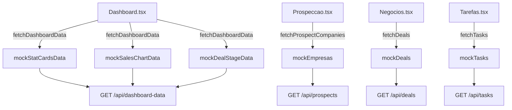

# Inventário de Mocks - Contta CRM
**Data**: 2025-11-09  
**Objetivo**: Mapear todos os mocks para substituição por dados reais

---

## 📊 Resumo Executivo

| Categoria | Quantidade | Status |
|-----------|------------|--------|
| **Mocks Totais** | 18 | 🔴 Pendente |
| **Arquivos com Import** | 3 | 🔴 Ativo |
| **Componentes Afetados** | ~15 | 🔴 Usando mock |

---

## 🗂️ Mocks Identificados em `data/mockData.ts`

### 1. Dashboard Data
| Mock | Tipo | Uso Atual | API Alvo | Prioridade |
|------|------|-----------|----------|------------|
| `mockStatCardsData` | `StatCardData[]` | `services/apiService.ts` | `GET /api/dashboard-data` | 🔴 Alta |
| `mockSalesChartData` | `SalesData[]` | `services/apiService.ts` | `GET /api/dashboard-data` | 🔴 Alta |
| `mockDealStageData` | `DealStageData[]` | `services/apiService.ts` | `GET /api/dashboard-data` | 🔴 Alta |
| `mockRecentActivities` | `RecentActivity[]` | `services/apiService.ts` | `GET /api/dashboard-data` | 🟡 Média |

**Componente**: `components/Dashboard.tsx`  
**Endpoint Real**: `/api/dashboard-data`  
**Schema Supabase**:
- `deals` → calcular estatísticas
- `tasks` → contagem pendente
- `empresas` → métricas de prospecção

---

### 2. Prospect Data (CNPJs)
| Mock | Tipo | Uso Atual | API Alvo | Prioridade |
|------|------|-----------|----------|------------|
| `mockProspectsCnpjs` | `string[]` | Não usado | `GET /api/prospects` | 🟢 Baixa |
| `mockEmpresas` | `Empresa[]` | `cnpjaService.ts`, `businessGenealogyService.ts` | `GET /api/cnpj-lookup` + Supabase | 🔴 Alta |

**Componentes**:
- `components/Prospeccao.tsx`
- `components/EmpresaDetalhe.tsx`

**Endpoint Real**: `/api/prospects?search=&limit=&offset=`  
**Schema Supabase**: Tabela `empresas`  
**API Externa**: CNPJá (https://api.cnpja.com)

---

### 3. Analytics Data
| Mock | Tipo | Uso Atual | API Alvo | Prioridade |
|------|------|-----------|----------|------------|
| `mockChurnPredictions` | `ChurnPrediction[]` | `services/apiService.ts` | `GET /api/analytics-data` | 🟡 Média |
| `mockUpsellOpportunities` | `UpsellOpportunity[]` | `services/apiService.ts` | `GET /api/analytics-data` | 🟡 Média |
| `mockAutomatedReport` | `AutomatedReport` | `services/apiService.ts` | `GET /api/analytics-data` | 🟢 Baixa |

**Componente**: `components/Analytics.tsx`  
**Endpoint Real**: `/api/analytics-data`  
**IA**: Gemini para geração de insights

---

### 4. Compliance Data
| Mock | Tipo | Uso Atual | API Alvo | Prioridade |
|------|------|-----------|----------|------------|
| `mockConsentStatus` | `ConsentStatus` | `services/apiService.ts` | `GET /api/compliance` | 🟢 Baixa |
| `mockDataAccessLogs` | `DataAccessLog[]` | `services/apiService.ts` | `GET /api/compliance` | 🟢 Baixa |

**Componente**: `components/Compliance.tsx`  
**Endpoint Real**: `/api/compliance`  
**Schema Supabase**: Tabela `audit_logs`

---

### 5. Indicações Data
| Mock | Tipo | Uso Atual | API Alvo | Prioridade |
|------|------|-----------|----------|------------|
| `mockIndicacoesStatus` | `ProgramaIndicacoesStatus` | `services/apiService.ts` | `GET /api/indicacoes?section=status` | 🟡 Média |
| `mockMinhasIndicacoes` | `Indicacao[]` | `services/apiService.ts` | `GET /api/indicacoes?section=minhas` | 🟡 Média |
| `mockEmpresasParaIndicar` | `EmpresaParaIndicar[]` | `services/apiService.ts` | `GET /api/indicacoes?section=sugestoes` | 🟡 Média |

**Componente**: `components/Indicacoes.tsx`  
**Endpoint Real**: `/api/indicacoes`  
**Schema Supabase**: Tabelas `indicacoes`, `empresas`

---

### 6. Report Generation Data
| Mock | Tipo | Uso Atual | API Alvo | Prioridade |
|------|------|-----------|----------|------------|
| `mockNetworkData` | `RedeDeVinculos[]` | Não usado | `GET /api/reports?type=network` | 🟢 Baixa |
| `mockTerritorialData` | `Empresa[]` | Não usado | `GET /api/reports?type=territorial` | 🟢 Baixa |
| `mockPerformanceData` | `object` | Não usado | `GET /api/reports?type=performance` | 🟢 Baixa |

**Componente**: `components/ReportGenerationModal.tsx`  
**Endpoint Real**: `/api/reports?type=network|territorial|performance`

---

### 7. Negócios (Deals)
| Mock | Tipo | Uso Atual | API Alvo | Prioridade |
|------|------|-----------|----------|------------|
| `mockDeals` | `Deal[]` | `services/apiService.ts` | `GET /api/deals` | 🔴 Alta |

**Componente**: `components/Negocios.tsx`  
**Endpoint Real**: `/api/deals`  
**Schema Supabase**: Tabela `deals`  
**Operações**: GET, POST, PATCH, DELETE

---

### 8. Tarefas (Tasks)
| Mock | Tipo | Uso Atual | API Alvo | Prioridade |
|------|------|-----------|----------|------------|
| `mockTasks` | `Task[]` | `services/apiService.ts` | `GET /api/tasks` | 🔴 Alta |

**Componente**: `components/Tarefas.tsx`  
**Endpoint Real**: `/api/tasks`  
**Schema Supabase**: Tabela `tasks`  
**Operações**: GET, POST, PATCH, DELETE

---

### 9. Equipe (Team)
| Mock | Tipo | Uso Atual | API Alvo | Prioridade |
|------|------|-----------|----------|------------|
| `mockTeamMembers` | `TeamMember[]` | `services/apiService.ts` | `GET /api/team` | 🟡 Média |

**Componente**: `components/Equipe.tsx`  
**Endpoint Real**: `/api/team`  
**Schema Supabase**: Tabela `profiles`  
**Permissões**: Admin only

---

## 📁 Arquivos com Imports de Mocks

### 1. `services/apiService.ts`
```typescript
import {
    mockChurnPredictions, mockUpsellOpportunities, mockAutomatedReport
} from '../data/mockData.ts';
```

**Funções Afetadas**:
- `fetchDashboardData()` - TODAS as respostas são mock
- `fetchAnalyticsData()` - usa `mockChurnPredictions`, `mockUpsellOpportunities`, `mockAutomatedReport`
- `fetchComplianceData()` - retorna mocks
- `fetchIndicacoesStatus()` - retorna mocks
- `fetchDeals()` - retorna mocks
- `fetchTasks()` - retorna mocks
- `fetchTeamMembers()` - retorna mocks

**Status**: 🔴 **100% MOCK - CRÍTICO**

---

### 2. `services/cnpjaService.ts`
```typescript
import { mockEmpresas } from '../data/mockData.ts';
```

**Funções Afetadas**:
- `lookupCNPJ()` - busca em `mockEmpresas` em vez de API CNPJá

**Status**: 🔴 **MOCK ATIVO - substituir por API real**

---

### 3. `services/businessGenealogyService.ts`
```typescript
import { mockEmpresas } from '../data/mockData.ts';
```

**Funções Afetadas**:
- `buildBusinessGenealogy()` - usa `mockEmpresas` para mapear rede

**Status**: 🔴 **MOCK ATIVO - substituir por CNPJá + cache Supabase**

---

## 🎯 Plano de Substituição

### Fase 1: Infraestrutura (AGORA)
- [ ] ✅ Validar schema Supabase (`supabase-schema.sql`)
- [ ] ✅ Executar seeds (`scripts/setup-database.js`)
- [ ] ✅ Configurar API CNPJá (obter chave)
- [ ] ✅ Criar endpoint `/api/dashboard-data`
- [ ] ✅ Criar endpoint `/api/deals`
- [ ] ✅ Criar endpoint `/api/tasks`

### Fase 2: Substituição em `apiService.ts` (PRÓXIMO)
- [ ] `fetchDashboardData()` → chamar `/api/dashboard-data`
- [ ] `fetchDeals()` → chamar `/api/deals`
- [ ] `fetchTasks()` → chamar `/api/tasks`
- [ ] `fetchTeamMembers()` → chamar `/api/team`

### Fase 3: Integração CNPJá (DEPOIS)
- [ ] `cnpjaService.ts` → API real com cache Supabase
- [ ] `businessGenealogyService.ts` → usar CNPJá recursivo

### Fase 4: Validação (FINAL)
- [ ] Deletar `data/mockData.ts`
- [ ] Remover todos os imports de mock
- [ ] `grep -r "mock" src/` deve retornar 0 resultados

---

## 📊 Métricas de Progresso

```
Total de Mocks: 18
Substituídos: 0
Pendentes: 18
Progresso: 0%

┌─────────────────────────────────────────────────────────────┐
│ [                                                      ] 0% │
└─────────────────────────────────────────────────────────────┘
```

---

## 🔗 Mapeamento Componente → Mock → API



---

## ✅ Critérios de Conclusão

1. **Zero imports** de `mockData.ts` em código de produção
2. **Zero exports** em `mockData.ts` (arquivo deve ser deletado)
3. **Build TypeScript** passa sem erros
4. **Grep** `grep -r "mock" src/` retorna 0 resultados (exceto comentários)
5. **Todos os componentes** carregam dados reais do Supabase/APIs

---

**Última Atualização**: 2025-11-09  
**Responsável**: Sistema de Auditoria MCP
